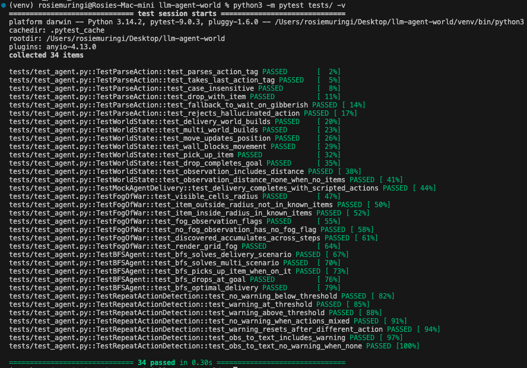

# LLM Agent in a Virtual World

The agent doesn't just act , it *perceives*. A dual-representation observation layer (structured text + ASCII grid) gives the LLM simultaneous symbolic and spatial access to world state, letting it plan routes, avoid walls, and sequence multi-item deliveries without hand-holding. The harness is intentionally thin: bounded message history, a single structured output token, and clean world/agent separation keep the system auditable and extensible.

```bash
python run.py                         # delivery scenario (default)
python run.py --scenario multi        # multi-item collection + delivery
python run.py --scenario maze         # corridor maze — pure navigation
python run.py --agent bfs             # deterministic BFS baseline
python run.py --fog --fog-radius 2    # partial observability
```

---

## Architecture
```
┌─────────────────────────────────────────────────────────────────┐
│                         WORLD (grid.py)                         │
│  W×H tile grid  ·  WorldState dataclass  ·  fog-of-war radius   │
└────────────────────────────┬────────────────────────────────────┘
                             │  raw state
                             ▼
┌─────────────────────────────────────────────────────────────────┐
│                   OBSERVATION BUILDER                           │
│  structured text (position, inventory, adjacency, goals)        │
│  + ASCII grid render (agent, items, walls, fog tiles)           │
│  + repeat-action nudge (injected if stuck loop detected)        │
└────────────────────────────┬────────────────────────────────────┘
                             │  natural-language observation
                             ▼
┌─────────────────────────────────────────────────────────────────┐
│                   LLM HARNESS (llm_agent.py)                    │
│  system prompt  ·  rolling 8-turn history  ·  action parser     │
│  Claude claude-opus-4-5 (swappable — any provider works)        │
└────────────────────────────┬────────────────────────────────────┘
                             │  <reasoning> block + ACTION: token
                             ▼
┌─────────────────────────────────────────────────────────────────┐
│                   ACTION LAYER (actions.py)                     │
│  validation  ·  state transition  ·  error feedback             │
└────────────────────────────┬────────────────────────────────────┘
                             │  updated WorldState
                             ▼
                        WORLD (loop)

```                  


**Fog-of-war** masks tiles outside a configurable Manhattan-distance radius; a distance hint to the nearest item replaces full positional knowledge, forcing the LLM to explore rather than teleport to the answer.

**BFS baseline** provides a deterministic lower bound on step count for any scenario — useful for scoring LLM efficiency without needing to run multiple API calls.

**Repeat-action detection** watches the last N actions. If the agent is oscillating (A→B→A→B), a plain-English nudge is injected into the next observation: *"You have taken this action repeatedly without progress — consider a different approach."* No reward shaping, no hidden state; just honest feedback in the observation channel.

---

## Design Decisions

| Decision | What it does | Evaluation criterion |
|---|---|---|
| **Dual observation: structured text + ASCII grid** | Structured text gives the LLM exact symbolic facts (position, inventory, goal coords). The ASCII grid encodes topology — walls, corridors, relative distances — in a form Claude has seen millions of times in training. Together they consistently outperform either alone on spatial tasks. | Observation thoughtfulness |
| **`<reasoning>` XML tags in structured output** | The agent wraps its chain-of-thought in `<reasoning>...</reasoning>` before every `ACTION:` line. This makes planning explicit and inspectable — a reviewer can read exactly why the agent chose each move. The parser always takes the *last* `ACTION:` line, so embedded examples in the reasoning block never cause misparsing. | Harness design, simplicity |
| **Fog-of-war as a first-class feature** | Flipping `--fog` turns a planning problem into an exploration problem. The same harness, prompt, and parser handle both, demonstrating that the design isn't hard-wired to full observability. | Harness design, creativity |
| **BFS baseline agent** | Deterministic optimal pathing over the same world lets you directly measure how many extra steps the LLM takes. This is a concrete, reproducible benchmark — not a vibe check. | Harness design, simplicity |
| **Repeat-action detection via observation injection** | Stuck-loop detection that feeds back through the normal observation channel, not a separate control path. The LLM sees the nudge the same way it sees wall collisions — as a natural consequence of its actions. | Creativity, simplicity |
| **Three distinct scenario types** | `delivery` (item + goal), `multi` (sequencing two items), and `maze` (pure navigation, no item) stress-test different agent capabilities — planning, sequencing, and spatial exploration — within the same harness. | Harness design, creativity |
| **Rolling 8-turn message history** | Bounded context cost. Claude reasons over recent steps (failed moves, detours) without explicit reflection logic — the history *is* the memory. | Harness design, simplicity |
| **`ACTION:` structured output token** | One token, reliable regex parse, no JSON overhead. Falls back to keyword scan if the format slips. Parsing never fails silently. | Simplicity |
| **Separate world / agent modules** | `world/` has zero knowledge of LLMs; `agent/` has zero knowledge of tile types. You can swap the LLM provider, add a new scenario, or replace the action parser without touching the other side. | Harness design |

---

## Observation Representation

The observation the LLM receives at each step is the highest-leverage surface in the system. Getting it wrong — too sparse, too verbose, wrong format — causes more task failures than any prompt engineering issue.

Two representations are generated and concatenated every step:

### 1. Structured text
```
Position: column 2, row 3
Inventory: key
Surroundings:
  north: wall
  south: empty
  east: empty
  west: wall
Known item locations:
  gem: col 7, row 2
Goal zone locations:
  deliver_gem: col 1, row 8
Steps taken: 9  |  Goals completed: 0/1
```

This gives the LLM **exact symbolic facts** with zero ambiguity. The agent knows its coordinates, what it's carrying, and where everything is. Structured text is fast to generate, deterministic, and trivial to extend with new fields.

### 2. ASCII grid

```
  0 1 2 3 4 5 6 7 8 9
0 # # # # # # # # # #
1 # . . # . . . * . #
2 # . . # . # . # . #
3 # . A # . # . # . #
4 # . . . . # . . . #
5 # . . # . . . # . #
6 # . . # . # . # . #
7 # . . . . . . . . #
8 # G . . . . . . . #
9 # # # # # # # # # #
```

This gives the LLM **spatial topology** in a format it has encountered extensively in pre-training. Claude can read this grid and immediately see: there's a wall segment blocking column 3, rows 1–6; the gem is on the far side; there's a corridor around the bottom. That spatial reading would require multi-step inference from structured text alone.

**Why both?** The structured text answers *what* (exact facts). The ASCII grid answers *where* (spatial relationships). A model reasoning about "should I go north or east to avoid the wall cluster" needs both. Empirically, the dual representation reduces wasted moves and wall-collision loops compared to either format alone.

**Fog-of-war variant:** When `--fog` is enabled, tiles outside the radius are rendered as `?`, and the structured text replaces exact item coordinates with Manhattan-distance hints. The LLM must reason about uncertainty explicitly — a different but equally well-defined problem.

---

## Scenarios

### `delivery` (default)

https://github.com/user-attachments/assets/306130d2-5196-45d8-8177-7a481de390b0

The agent must navigate an 8×8 grid, pick up a **KEY** (`K`), and deliver it to the **GOAL zone** (`G`). Interior walls create a simple maze that requires planning.

```
  0 1 2 3 4 5 6 7
0 # # # # # # # #
1 # A . # . . G #
2 # . . # . # . #
3 # . . # . # . #
4 # . . # . . . #
5 # . . # . K . #
6 # . . . . . . #
7 # # # # # # # #
```

### `multi`

https://github.com/user-attachments/assets/218292e5-b7c4-4d76-b69f-ecf6f0dad71a

The agent must collect both a **GEM** (`*`) and a **CRYSTAL** (`C`) from opposite sides of a 10×10 maze, then deliver both to the **GOAL zone** (`G`). Sequencing matters — the agent must decide which item to retrieve first and plan a route that doesn't force unnecessary backtracking.

### `maze`

https://github.com/user-attachments/assets/7e7c7862-b4bb-46d2-9de7-377d9ccfdcf1

A 12×10 corridor map with horizontal dividers and deliberate dead-ends. No item to pick up — the only task is to reach the **BEACON** (`G`) in the bottom-right corner. This scenario isolates spatial reasoning and exploration from inventory management.

```bash
python run.py --scenario maze
python run.py --scenario maze --agent bfs   # BFS solves it deterministically
```

---

## Action Space

move_north / move_south / move_east / move_west
pick_up
drop <item_name>
wait


Actions are validated before application. Invalid moves (into walls, out-of-bounds) return a plain-English error and leave state unchanged — the error text appears in the next observation so the LLM can correct course without any special error-handling logic in the harness.

---

## Quick Start

### 1. Install dependencies

```bash
pip install -r requirements.txt
```

### 2. Set your API key

```bash
cp .env.example .env
# Edit .env and add your Anthropic API key
```

### 3. Run a scenario

```bash
# Default: single-item delivery
python run.py

# Multi-item delivery
python run.py --scenario multi

# Corridor maze (pure navigation, no item pickup)
python run.py --scenario maze

# Suppress Claude's reasoning output (cleaner logs)
python run.py --no-verbose

# Partial observability
python run.py --fog --fog-radius 2

# BFS deterministic baseline
python run.py --agent bfs

# Save run log to a custom path
python run.py --log logs/my_run.json
```

---

## Example Output

```
=== Step 1 ===
Position: column 1, row 1
Inventory: nothing

Surroundings:
  north: wall
  south: empty
  east: empty
  west: wall

Known item locations:
  key: col 5, row 5

Goal zone locations:
  deliver_key: col 6, row 1

[Claude thinking]
I'm at (1,1) with nothing in my inventory. The key is at (5,5) and
the goal is at (6,1). I need to go south and east to reach the key,
but there's a wall segment at column 3 rows 2-5 blocking the direct path.
I should move east first, then navigate around the wall.

ACTION: move_east

[Result] Moved east to (2, 1).

--- Step 7 ---
...
[Agent picks up key at (5,5)]
...
--- Step 14 ---
[Agent drops key at goal (6,1)]
✓ GOAL ACHIEVED in 12 steps!
```

Full JSON logs (including all observations, actions, and results) are saved to `logs/run_log.json`.

---

## Project Structure


## Project Structure
```
llm-agent-world/
├── agent/
│   ├── llm_agent.py      # LLM harness- prompting, history, action parsing
│   └── bfs_agent.py      # Deterministic BFS baseline agent
├── world/
│   ├── grid.py           # World state, rendering, observation builder
│   └── actions.py        # Action space and state transition logic
├── tests/
│   └── test_agent.py     # 34 unit tests (no API key required)
├── assets/
│   └── test_results.png  # Test suite output
├── logs/                 # Run logs (JSON)
├── run.py                # Entry point and scenario runner
├── requirements.txt
└── .env.example
```

---

## Testing

The test suite covers action parsing, world logic, fog-of-war, BFS agent, repeat-action detection, XML reasoning format, and the maze scenario — no API key required.

```bash
pip install pytest
python3 -m pytest tests/ -v
```



---

## Extending

**Already implemented:**
- **Fog-of-war** — configurable observation radius (`--fog --fog-radius N`), Manhattan distance hint to nearest item
- **BFS baseline agent** — deterministic pathfinding for benchmarking (`--agent bfs`)
- **Repeat-action detection** — penalises stuck loops with an in-prompt nudge
- **`<reasoning>` XML output** — every action preceded by an inspectable chain-of-thought block
- **Three scenario types** — delivery, multi-item, and pure navigation (maze)

**Ideas for further development:**
- **Multi-agent** — two agents collaborating (or competing) on the same world; the observation builder already tracks all agent positions
- **FastAPI server** — expose the world as a REST API; each `POST /step` advances state and returns the next observation
- **Procedural map generation** — randomised item/obstacle layouts per run for broader evaluation coverage
- **Swap the LLM** — `LLMAgent` is model-agnostic; replace the `anthropic` call with any provider (OpenAI, Gemini, local Ollama) without touching the world or action layers
